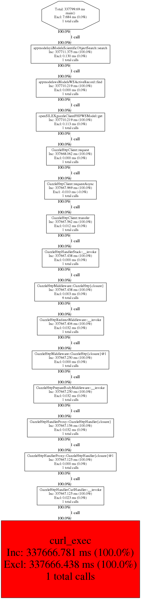

# Integration of XHProf profiler to the OpenSILEX WebApp (use case: export of all scientific objects)

## I/ Prerequisite
- 1/ [XHProf-Tideways extension](https://github.com/tideways/php-xhprof-extension.git)

- 2/ [Tideways Toolkit (tk)](https://github.com/tideways/toolkit.git) *A collection of commandline tools*


- 3/ [Graphviz](https://doc.ubuntu-fr.org/graphviz) *Graph Visualization Software*


<br>


## 1/ Installation of XHProf-Tideways 

XHProf is a profiler designed to analyze PHP applications. Initially created and open sourced by Facebook (compatible with php5). Tideways company maintain a fork of the original XHProf extension that provides PHP 7 support [Tideways XHProf extension](https://github.com/tideways/php-xhprof-extension.git).


### Install the server Dependencies


```console
user@phis:~$ sudo apt install php7.0-dev

//install the extension from source
user@phis:~$ git clone https://github.com/tideways/php-xhprof-extension.git
user@phis:~$ cd php-xhprof-extension/
user@phis:~$ phpize
user@phis:~$ ./configure
user@phis:~$ make
user@phis:~$ sudo make install
```

Include the following contents in the php.ini file:
```
extension=tideways_xhprof.so
```
Restart Apache
```console
user@phis:~$ sudo systemctl restart apache2
```


## 2/ Installation of Tideways Toolkit (tk)  

### Prerequisite
- [Go](https://golang.org/dl/) *Tideways Toolkit is written in Go and you can install it with the Go compiler*

```console
user@phis:~$ go get github.com/tideways/toolkit
```

You will then find the compiled binary in ```/home/$USER/code/golang/bin/toolkit``` and can copy or symlink it to ```/usr/local/bin/tk```
</br>


## 3/ Installation of Graphviz
```console
user@phis:~$ sudo apt install graphviz
```
</br>
</br>

## II/ Profilling OpenSILEX webapp (export of scientific objects use case)

### Code source integration

Add the fellowing instructions to enable and disable the profiler

```php
if (extension_loaded('tideways_xhprof')) {
    tideways_xhprof_enable(TIDEWAYS_XHPROF_FLAGS_MEMORY | TIDEWAYS_XHPROF_FLAGS_CPU);
}
```


```php
if (extension_loaded('tideways_xhprof')) {
    $data = tideways_xhprof_disable();
    file_put_contents(
        sys_get_temp_dir() . "/ScientificObjectController_profiling.xhprof",
        json_encode($data)
        );
}
```

In this case we enable the profiler when starting export of scientific objects and disable it before sending the result.

```php
<?php
/*
phis-webapp/controllers/ScientificObjectController.php 
*/
public function actionDownloadCsv() {

//---------->>>>>>>>>> XHProf integration
if (extension_loaded('tideways_xhprof')) {
    tideways_xhprof_enable(TIDEWAYS_XHPROF_FLAGS_MEMORY | TIDEWAYS_XHPROF_FLAGS_CPU);
}
//----------<<<<<<<<<<


$searchModel = new ScientificObjectSearch();
if (isset($_GET['model'])) {
    $searchParams = $_GET['model'];
    $searchModel->label = isset($searchParams["alias"]) ? $searchParams["alias"] : null;  //why alias ? and not label , c'est quoi l'alias ?
    $searchModel->type = isset($searchParams["type"]) ? $searchParams["type"] : null;
    $searchModel->experiment = isset($searchParams["experiment"]) ? $searchParams["experiment"] : null;
}
$searchParams = []; // ???
// Set page size to 10000 for better performances
$searchModel->pageSize = 10000;
//get all the data (if multiple pages) and write them in a file
$serverFilePath = \config::path()['documentsUrl'] . "AOFiles/exportedData/" . time() . ".csv";
$stringToWrite = "ScientificObjectURI" . Yii::$app->params['csvSeparator'] .
        "Alias" . Yii::$app->params['csvSeparator'] .
        "RdfType" . Yii::$app->params['csvSeparator'] .
        "ExperimentURI" . Yii::$app->params['csvSeparator'] .
        "Geometry" .
        "\n";
$totalPage = 1;
for ($i = 0; $i < $totalPage; $i++) {
    //1. call service for each page
    $searchParams["page"] = $i;
    $searchResult = $searchModel->search(Yii::$app->session['access_token'], $searchParams);
    //2. write in file
    $models = $searchResult->getmodels();
    foreach ($models as $model) {
        // Parse geoJson geometry to WKT if exists
        $geoJson = $model->geometry;
        if ($geoJson != null) {
            $geom = \geoPHP::load($model->geometry, 'json');
            $wktGeometry = (new \WKT())->write($geom);
        } else {
            $wktGeometry = "";
        }

        $stringToWrite .= $model->uri . Yii::$app->params['csvSeparator'] . 
                            $model->label . Yii::$app->params['csvSeparator'] .
                            $model->rdfType . Yii::$app->params['csvSeparator'] .
                            $model->experiment . Yii::$app->params['csvSeparator'] . 
                            '"' . $wktGeometry . '"' . Yii::$app->params['csvSeparator'] . 
                            "\n";
    }
    $totalPage = intval($searchModel->totalPages);
}
file_put_contents($serverFilePath, $stringToWrite, FILE_APPEND);

//---------->>>>>>>>>> XHProf integration
if (extension_loaded('tideways_xhprof')) {
    $data = tideways_xhprof_disable();
    file_put_contents(
        sys_get_temp_dir() . "/ScientificObjectController_profiling.xhprof",
        json_encode($data)
        );
}
//----------<<<<<<<<<<

Yii::$app->response->sendFile($serverFilePath);
}


```

### Generation of callgraph visualization
```console
user@phis:~$ cd /tmp
user@phis:~$ tk generate-xhprof-graphviz ScientificObjectController_profiling.xhprof
```


### Convert callgraph to a viewable image
```console
user@phis:~$ dot -Tpng callgraph.dot > callgraph.png
```

callgraph.png



	

    